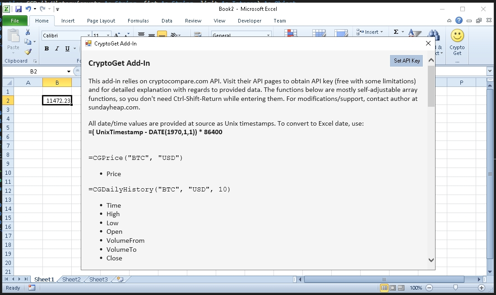

# CryptoGet Add-In

This add-in relies on [cryptocompare.com](https://www.cryptocompare.com) API. Visit their API pages to obtain API key (free with some limitations) and for detailed explanation with regards to provided data.
The functions below are mostly self-adjustable array functions, so you don't need Ctrl-Shift-Return while entering them. For modifications/support, contact author at [sundayheap.com](http://sundayheap.com).

All date/time values are provided at source as Unix timestamps. To convert to Excel date, use:

**=( UnixTimestamp - DATE(1970,1,1)) * 86400**

## UI

The add-in has a single window used to set the API key and, also, to provide information about returned values.

## Available Functions

=CGPrice("BTC", "USD")
- Price

=CGDailyHistory("BTC", "USD", 10)
- Time
- High
- Low
- Open
- VolumeFrom
- VolumeTo
- Close

=CGHourlyHistory("BTC", "USD", 10)
- Time
- High
- Low
- Open
- VolumeFrom
- VolumeTo
- Close

=CGMinuteHistory("BTC", "USD", 10)
- Time
- High
- Low
- Open
- VolumeFrom
- VolumeTo
- Close

=CGAddresses("BTC")
- ID
- Time
- Zero balance addresses all time
- Unique addresses all time
- New addresses
- Active addresses

=CGAvgTransactions("BTC")
- Average transaction value
- Transaction count
- Transaction count all time
- Large transaction count

=CGBlock("BTC")
- Block height
- Hash rate
- Difficulty
- Block time
- Block size
- Current supply

=CGBlockDaily("BTC", "10")
- Time
- Block height
- Hash rate
- Difficulty
- Block time
- Block size
- Current supply

=CGITBinOutVar("BTC")
- Value
- Score
- Score threshold bearish
- Score threshold bullish

=CGITBlargetxsVar("BTC")
- Value
- Score
- Score threshold bearish
- Score threshold bullish

=CGITBaddressesNetGrowth("BTC")
- Value
- Score
- Score threshold bearish
- Score threshold bullish

=CGITBconcentrationVar("BTC")
- Value
- Score
- Score threshold bearish
- Score threshold bullish

=CGCustomData("BTC", "USD", "PRICE|SUPPLY|MKTCAP")

Return multiple measures as per pipe-delimited request. Available measures are:

TYPE | FLAGS | PRICE | LASTUPDATE | MEDIAN | LASTVOLUME | LASTVOLUMETO | LASTTRADEID | VOLUMEDAY | VOLUMEDAYTO | VOLUME24HOUR | VOLUME24HOURTO | OPENDAY | HIGHDAY | LOWDAY | OPEN24HOUR | HIGH24HOUR | LOW24HOUR | VOLUMEHOUR | VOLUMEHOURTO | OPENHOUR | HIGHHOUR | LOWHOUR | TOPTIERVOLUME24HOUR | TOPTIERVOLUME24HOURTO | CHANGE24HOUR | CHANGEPCT24HOUR | CHANGEDAY | CHANGEPCTDAY | CHANGEHOUR | CHANGEPCTHOUR | SUPPLY | MKTCAP | TOTALVOLUME24H | TOTALVOLUME24HTO | TOTALTOPTIERVOLUME24H | TOTALTOPTIERVOLUME24HTO

## Further Work

- Perhaps hook up websockets part of the API to Excel RTD
- Cache certain API calls (i.e. daily history)
- Add return and log return functions
- Add simple portfolio simulation / risk measures (MC with Cholesky, incl. intermediate outputs)

## Credits

[ExcelDNA and Govert van Drimmelen](https://github.com/Excel-DNA/ExcelDna)

[cryptocompare.com](https://www.cryptocompare.com)

Coded with VS2017 and .NET Framework 4.6.2